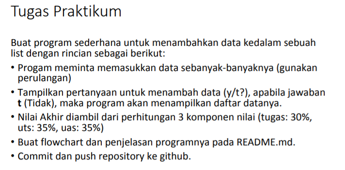
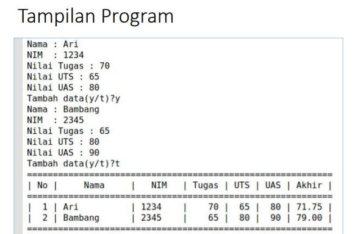
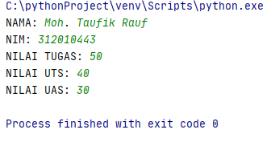
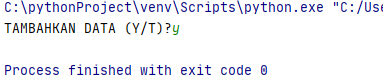
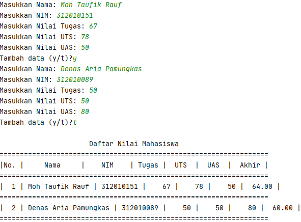
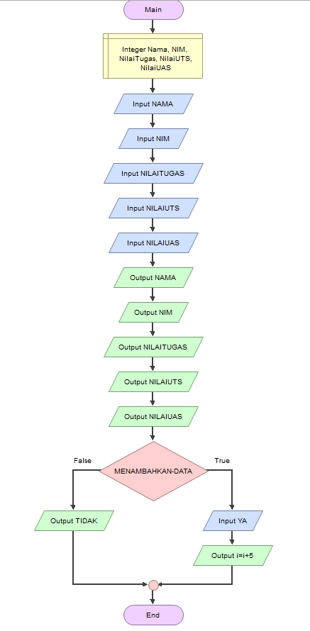

### NAMA  : MUHAMMAD BISMA PUTRA H
### NIM   : 312010443
### KELAS : TI.20.A.1

Pada di pertemuan ke 9 ini saya diberikan beberapa tugas oleh dosen saya, yaitu diantaranya:
## TUGAS PRAKTIKUM 4
Yang mana pada praktikum 4 ini terdapat beberapa soal seperti yang ada dibawah ini.
 <br>
Adapun hasil akhir yang diberikan dosen saya sebagai contoh output dari semua tugas diatas.
 <br>
_________________________________________________________________________________________________
Pada soal pertama, yang dimana disini saya diminta untuk memasukan data sebanyak-banyaknya. Jadi disini saya akan mencoba memasukan beberapa data diantaranya seperti **NAMA, NIM, NILAI TUGAS, NILAI UTS** dan yang terakhir **NILAI UAS**

Dan untuk dapat menambahkan data-data tersebut maka kita perlu memasukan syntax seperti ini.
```python
nama = input("NAMA: ")
nim = input("NIM: ")
tugas = int(input("NILAI TUGAS: "))
uts = int(input("NILAI UTS: "))
uas = int(input("NILAI UAS: "))
```
Setelah memasukan syntax diatas dan kalian run, maka akan mendapatkan hasil output seperti gambar dibawah ini
 <br>
______________________________________________________________________________________________________________________________________
Lanjut pada soal kedua, yang dimana saya diminta untuk membuat sebuah pernyataan **YA/TIDAK** pada pertanyaan 'apakah ingin menambahkan sebuah data?'

Dan untuk dapat menambahkan data-data tersebut maka kita perlu memasukan syntax seperti ini
```python
if (input("TAMBAHKAN DATA (Y/T)?") == ''):
    ulang = False
```
Setelah memasukan syntax diatas dan kalian run, maka akan mendapatkan hasil output seperti gambar dibawah ini
 <br>
________________________________________________________________________________________________________________________________________

Setelah mengerjakan beberapa soal diatas, selanjutnya ada beberapa syntax yang saya tambahkan agar tampilan akhir dari ouput saya menjadi sama persis seperti yang ditunjukan oleh dosen saya. Oleh karena itu saya membutuhkan syntax seperti ini
```python
nilai = []
ulang = True

while ulang:
    nama = input("Masukkan Nama: ")
    nim = input("Masukkan NIM: ")
    tugas = int(input("Masukkan Nilai Tugas: "))
    uts = int(input("Masukkan Nilai UTS: "))
    uas = int(input("Masukkan Nilai UAS: "))
    akhir = (tugas * 30/100) + (uts * 35/100) + (uas * 35/100)

    nilai.append([nama, nim, tugas, uts, uas, int(akhir)])
    if (input("Tambah data (y/t)?") == 't'):
        ulang = False

print("\n                      Daftar Nilai Mahasiswa")
print("==================================================================")
print("|No. |     Nama     |    NIM    | Tugas |  UTS  |  UAS  |  Akhir |")
print("==================================================================")
i = 0
for item in nilai:
    i += 1
    print("| {no:2d} | {nama:12s} | {nim:9s} | {tugas:5d} | {uts:5d} | {uas:5d} | {akhir:6.2f} |"
          .format(no=i, nama=item[0], nim=item[1], tugas=item[2], uts=item[3], uas=item[4], akhir=item[5]))
print("==================================================================")
```
Setelah memasukan syntax diatas dan kalian run, maka akan mendapatkan hasil output seperti gambar dibawah ini
 <br>
____________________________________________________________________________________________________________________________________________
Lanjut pada soal terakhir, yang dimana disini saya diminta untuk membuat sebuah Flowchart dari diatas
 <br>
Dan kurang lebih seperti itulah bentuk flowchart yang sudah saya buat.

## *****************SELESAI!!***************** ##
## ***************TERIMAKASIH!!*************** ##


